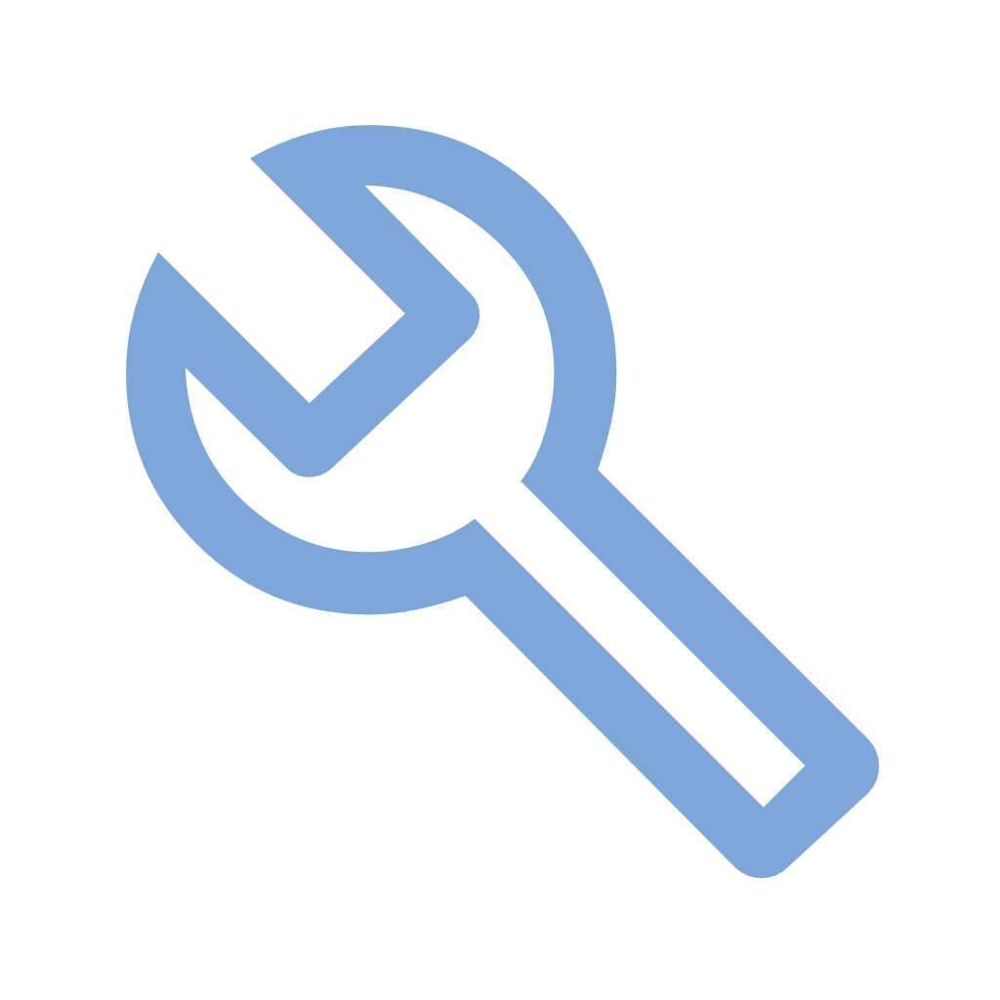
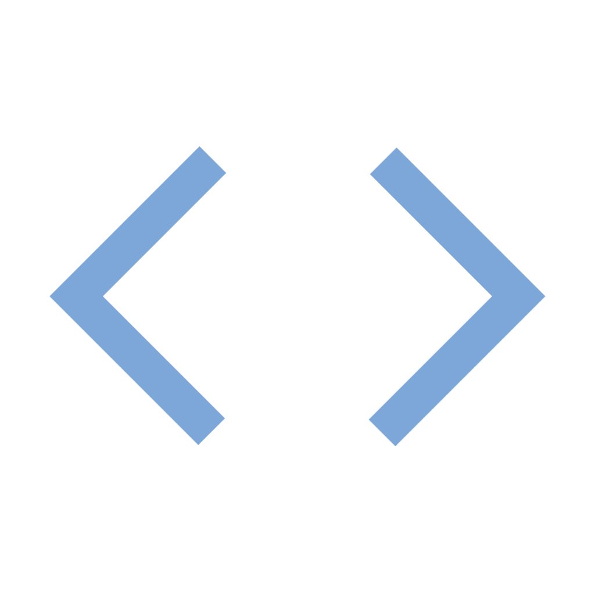

<h1 align="center">
  aurumOS Next
  
</h1>

<div align="center">


<!--  -->

</div>

##  Description

**[aurumOS Next](https://aurumos.site/next)** is a highly secure, efficient, and portable Unix-like operating system based on NetBSD. 
Designed to meet modern computing needs, it is adaptable for various platforms, from servers and desktops 
to embedded systems. This repository contains the tools and configurations needed to build aurumOS Next, 
making it ideal for developers seeking a highly customizable NetBSD-based OS.

##  Building

You can cross-build aurumOS Next from most UNIX-like operating systems. 
To build for `amd64` (x86_64), run the following command in the repository's root directory:

```sh
./build.sh -U -u -j4 -m amd64 -O ~/obj release
```

Additional build information is available in the [BUILDING](BUILDING) file.

##   Binaries

- [Daily builds](https://github.com/Ecliptica-Ltd/aurumOS-Next/actions)
- [Releases](https://github.com/Ecliptica-Ltd/aurumOS-Next/releases)

##  Troubleshooting

Report bugs and patches via the issue tracker.
Join the community discussion on aurumOS forums.

##  Latest Sources
To fetch the sources for aurumOS Next:
```bash
git clone https://github.com/Ecliptica-Ltd/aurumOS-Next.git
```
